# Telesales App — Tính năng theo vai trò

Ứng dụng di động (PWA) chạy trên điện thoại, kết nối hệ thống **CEP / TinyCRM**. Giao diện tối giản một cột, thao tác bằng ngón tay, có **thông báo đẩy (push)** và **cập nhật trực tiếp** khi có việc mới.

App phục vụ **3 vai trò**, mỗi vai trò có màn hình và menu dưới (bottom nav) riêng. Vai trò được xác định theo tài khoản đăng nhập:

| Vai trò                              | Tên trong app          | Nhiệm vụ chính                                                        |
| ------------------------------------- | ----------------------- | ------------------------------------------------------------------------ |
| **Telesale**                    | Nhân viên gọi khách | Gọi lead, tư vấn, đặt lịch hẹn đến                              |
| **ĐTV / Trợ lý điều trị** | Điều trị viên       | Tư vấn tại chỗ, chốt gói, ghi phác đồ, xếp lịch buổi         |
| **CSKH**                        | Chăm sóc khách hàng | Chăm khách đang điều trị, đặt buổi tiếp, theo dõi nhịp chăm |

> **Cách chèn ảnh:** mỗi tính năng bên dưới đã chừa sẵn một chỗ ảnh trỏ tới `images/<tên-file>.png`. Chụp màn hình rồi lưu vào thư mục `docs/images/` **đúng tên file** đã ghi — ảnh sẽ tự hiện lên.

---

## Mục lục

* [A. Tính năng dùng chung (mọi vai trò)](#a-t%C3%ADnh-n%C4%83ng-d%C3%B9ng-chung-m%E1%BB%8Di-vai-tr%C3%B2)
* [B. Vai trò Telesale](#b-vai-tr%C3%B2-telesale)
* [C. Vai trò ĐTV / Trợ lý điều trị](#c-vai-tr%C3%B2-%C4%91tv--tr%E1%BB%A3-l%C3%BD-%C4%91i%E1%BB%81u-tr%E1%BB%8B)
* [D. Vai trò CSKH (Chăm sóc khách hàng)](#d-vai-tr%C3%B2-cskh-ch%C4%83m-s%C3%B3c-kh%C3%A1ch-h%C3%A0ng)
* [E. Tính năng UI bên CEP web (liên quan app)](#e-t%C3%ADnh-n%C4%83ng-ui-b%C3%AAn-cep-web-li%C3%AAn-quan-app)

---

## A. Tính năng dùng chung (mọi vai trò)

### A1. Đăng nhập bằng tài khoản CEP

Đăng nhập bằng **tên đăng nhập + mật khẩu** của hệ thống CEP, có tùy chọn **ghi nhớ đăng nhập**. Phiên đăng nhập giữ bằng cookie an toàn; app tự xác định vai trò và đưa thẳng vào màn hình phù hợp.

<em>📸 Ảnh: Màn hình đăng nhập</em>

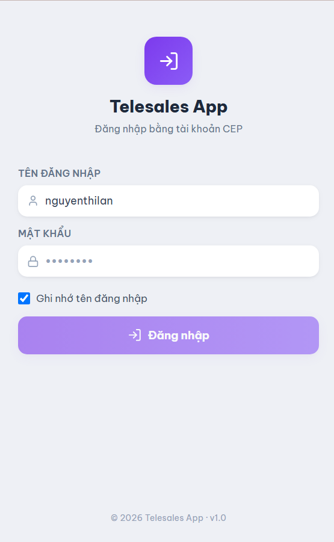

### A2. Trung tâm thông báo (chuông)

Nút **chuông** ở góc phải màn Tổng quan, có **chấm đỏ đếm số thông báo chưa đọc**. Bấm mở danh sách thông báo: khách mới được phân, nhắc lịch hẹn, khách quay lại, khách check-in, hoàn thành buổi… Bấm vào một thông báo sẽ **nhảy thẳng tới khách/lead** liên quan.

<em>📸 Ảnh: Danh sách thông báo (có mục chưa đọc)</em>

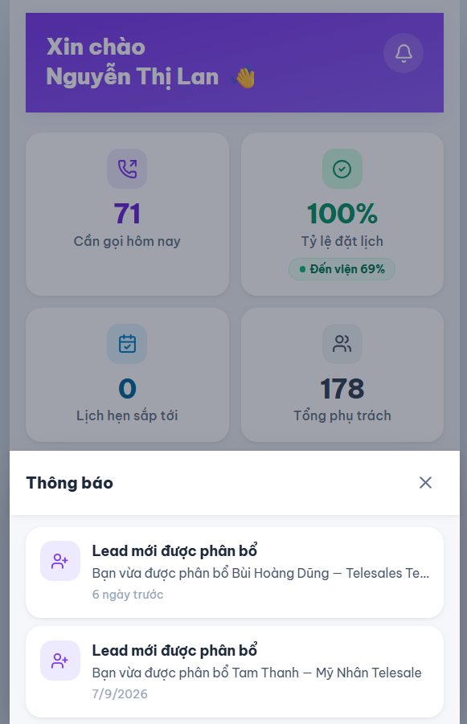

### A3. Nhận thông báo đẩy & cập nhật trực tiếp

Bật **thông báo đẩy** để nhận báo ngay cả khi không mở app. Khi có việc mới (push đến hoặc mở lại app), các màn hình **tự làm mới tại chỗ** — không cần kéo để tải lại.

<em>📸 Ảnh: Thẻ bật thông báo đẩy trong Cá nhân</em>

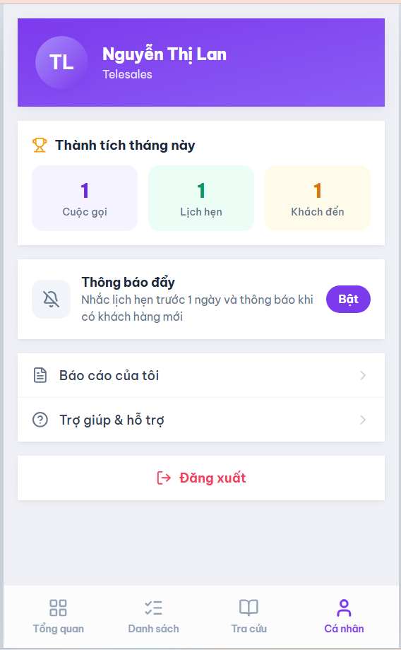

### A4. Tra cứu KB (cẩm nang / kiến thức)

Màn **Tra cứu** dùng chung cho mọi vai trò: ô tìm kiếm lớn, **Chủ đề phổ biến** (thẻ xu hướng), **Danh mục** theo kệ; kết quả tìm kiếm mở ra **trình đọc** với mục lục Kệ → Sách → Chương → Trang và nội dung chi tiết.

<em>📸 Ảnh: Màn tra cứu KB + trình đọc</em>

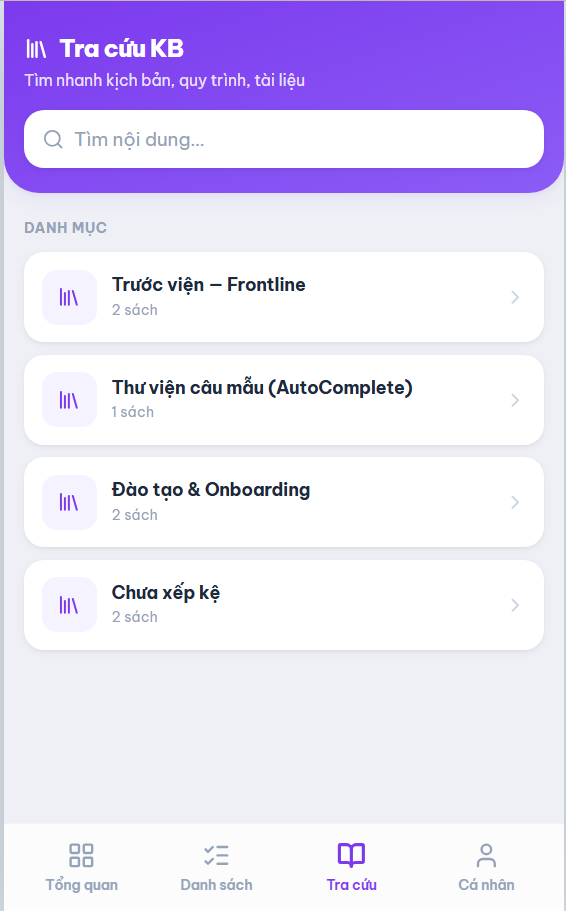

### A5. Cá nhân & Thành tích

Màn **Cá nhân** hiển thị thẻ hồ sơ, **Thành tích tháng này** (số cuộc gọi / đặt lịch / khách đến), thẻ bật/tắt thông báo đẩy, menu **Báo cáo của tôi**, **Trợ giúp & hỗ trợ**, và nút **Đăng xuất**.

<em>📸 Ảnh: Màn Cá nhân</em>

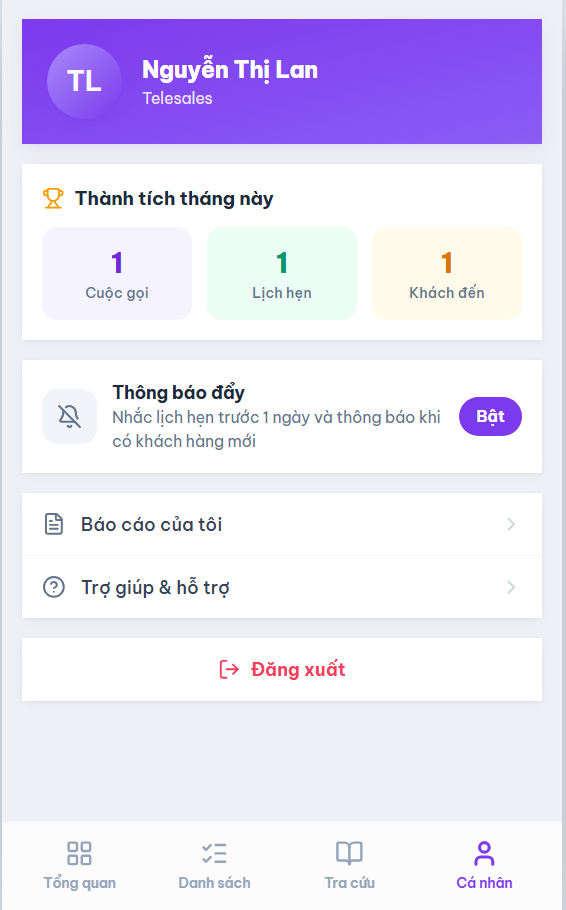

---

## B. Vai trò Telesale

Menu dưới: **Tổng quan · Danh sách · Tra cứu · Cá nhân**.

### B1. Tổng quan Telesale

Lời chào + chuông thông báo; **4 thẻ chỉ số**: Cần gọi hôm nay (kèm số quá hạn), Tỷ lệ đặt lịch (kèm tỷ lệ đến), Lịch hẹn sắp tới, Tổng phụ trách. Có thanh **tiến độ "Đã xử lý hôm nay"**, nút **"Bắt đầu gọi"**, và danh sách **lịch hẹn sắp tới** (bấm để gọi nhanh).

<em>📸 Ảnh: Tổng quan Telesale</em>

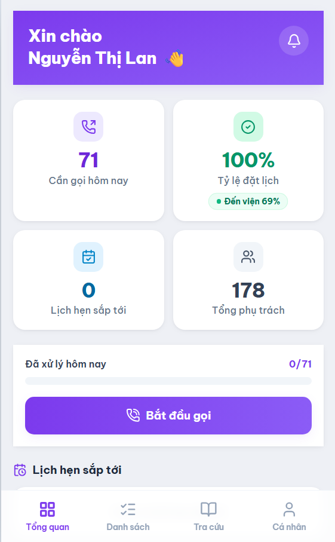

### B2. Danh sách gọi

Tìm theo **tên / số điện thoại**; lọc nhanh bằng chip trạng thái: **Mới / Quá hạn / Gọi lại / Đã đặt lịch / Đã đóng**. Mỗi lead là một thẻ có ảnh đại diện, nhãn trạng thái, cờ **"Cân nhắc"** (lead tiềm năng) và tag **"Lễ tân trả về"**; bấm để gọi ngay.

<em>📸 Ảnh: Danh sách gọi + chip lọc</em>

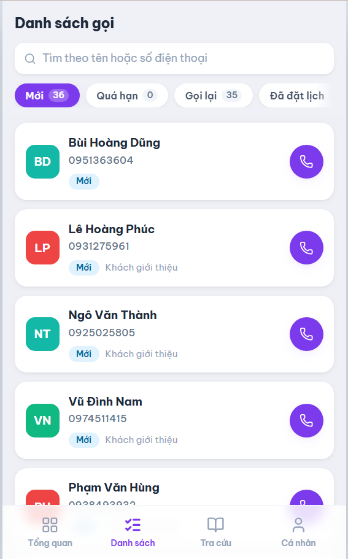

### B3. Chi tiết lead — Gọi & Kịch bản

Đầu màn có tên/SĐT với **"Gọi ngay"** (bắt buộc xem popup **Nguyên tắc tư vấn** trước khi quay số) và **"Kịch bản gọi"** (kịch bản do AI tạo). Có nút gạt **"Cân nhắc"** đánh dấu lead nóng.

<em>📸 Ảnh: Đầu màn chi tiết lead (Gọi ngay / Kịch bản)</em>

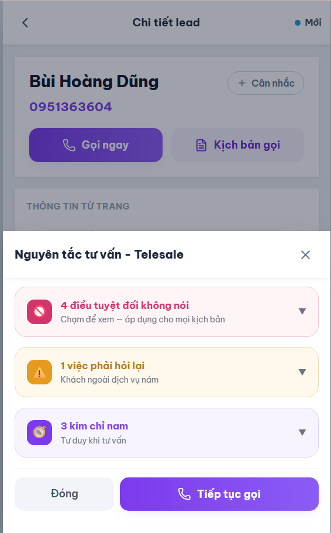

### B4. Chi tiết lead — Thông tin khách & Ảnh

**Thông tin từ trang** (nhu cầu, thời điểm nhận), **Thông tin khách** đầy đủ (kèm thuộc tính động), và khối **Ảnh đính kèm** (tải lên / xem / xoá, mở lightbox phóng to).

<em>📸 Ảnh: Thông tin khách + Ảnh đính kèm</em>

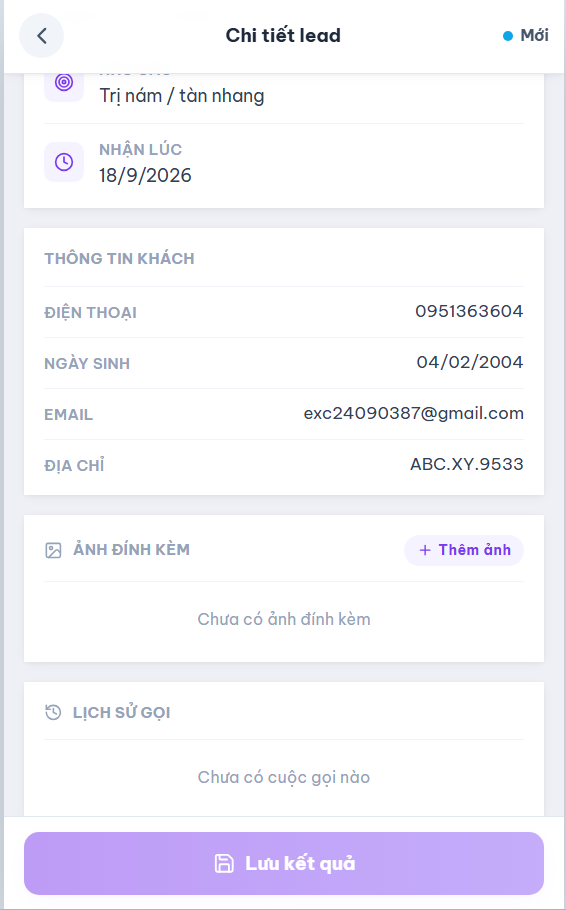

### B5. Kịch bản gọi bằng AI

Sheet **"Tạo kịch bản gọi"**: các bước gấp/mở được, tự **tô đậm từ khoá và con số**, nội dung thay đổi theo trạng thái lead — giúp gọi tự tin, đúng trọng tâm.

<em>📸 Ảnh: Sheet kịch bản gọi AI</em>

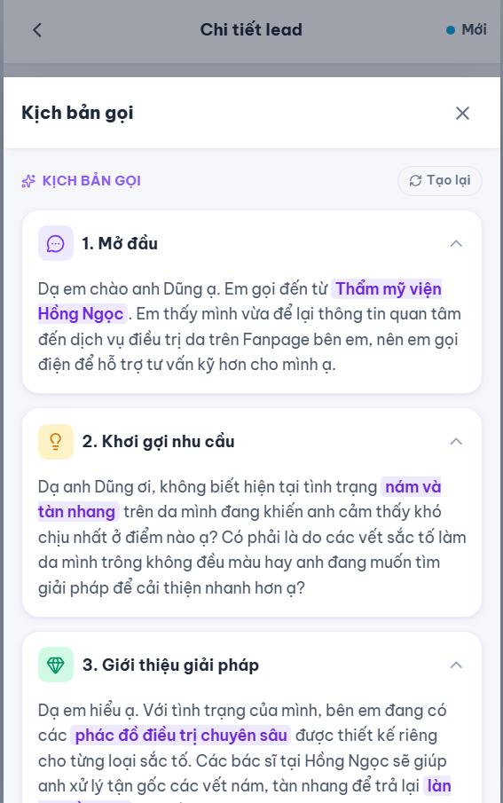

### B6. Cập nhật kết quả cuộc gọi

Sau khi gọi, chọn kết quả: **Sai số / Từ chối / Gọi lại / Đã đặt lịch**, kèm ô ghi chú và **lịch sử cuộc gọi**.

<em>📸 Ảnh: Khối cập nhật kết quả cuộc gọi</em>

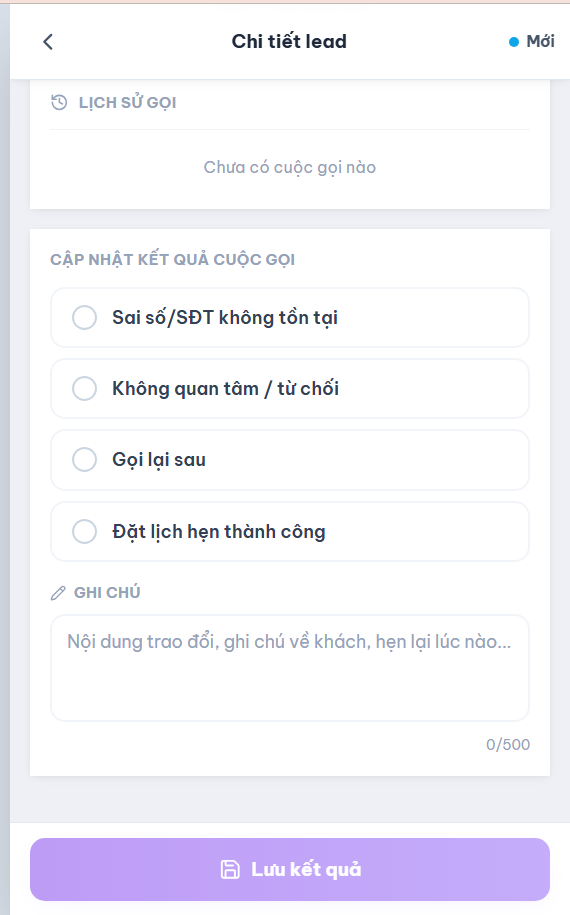

### B7. Đặt lịch hẹn đến

Luồng đặt lịch: chọn **chi nhánh → chọn ngày → chọn khung giờ** (khung giờ lấy theo tình trạng chỗ trống thực tế từ CEP).

<em>📸 Ảnh: Luồng đặt lịch (chi nhánh / ngày / giờ)</em>

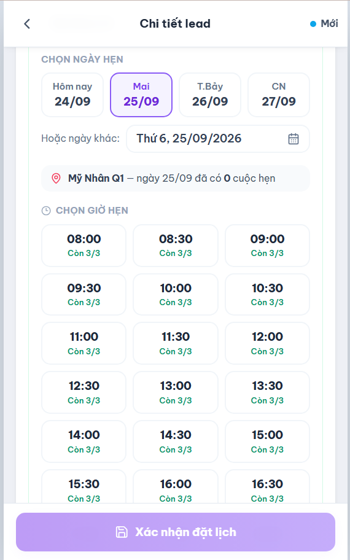

### B8. Dời lịch & Huỷ lịch

**Dời lịch** sang khung khác, hoặc **huỷ lịch** kèm lý do với 2 hướng xử lý tiếp: **gọi lại** hoặc **đóng lead**.

<em>📸 Ảnh: Dời / huỷ lịch hẹn</em>

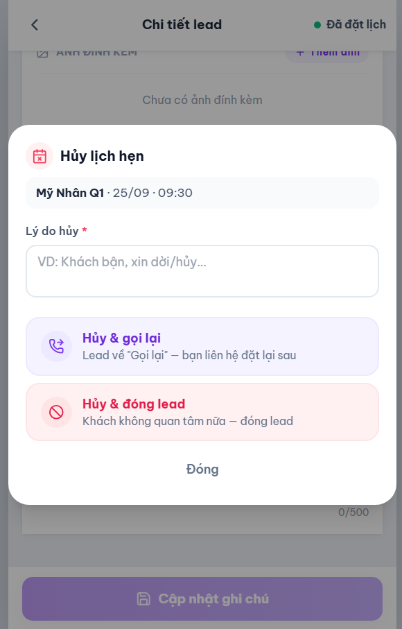

---

## C. Vai trò ĐTV / Trợ lý điều trị

Menu dưới: **Tổng quan · Khách ĐT · Lịch hẹn · Tra cứu · Cá nhân**.

### C1. Tổng quan ĐTV

Lời chào + chuông; **4 thẻ chỉ số**: Cần tư vấn, Đã chốt, Chờ thanh toán, Cần xếp phòng. Bên dưới là danh sách **Khách hàng** xem nhanh (kèm nhãn hạng khách / vòng đời / thanh toán), bấm mở chi tiết.

<em>📸 Ảnh: Tổng quan ĐTV</em>

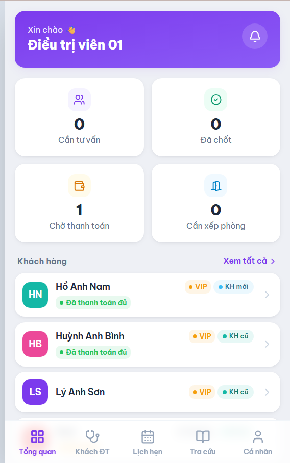

### C2. Danh sách khách hàng

"Cập nhật phác đồ & nhật ký từng buổi." Tìm theo **tên / SĐT / liệu trình** (tìm trên server), lọc theo hạng khách (**KH mới / KH cũ / Thường / VIP**), **cuộn vô hạn** để tải thêm. Mỗi thẻ có điểm sao QA, hạng khách, tình trạng thanh toán, liệu trình, biểu tượng nhóm Zalo và thời gian chăm gần nhất.

<em>📸 Ảnh: Danh sách khách ĐT + chip lọc hạng</em>

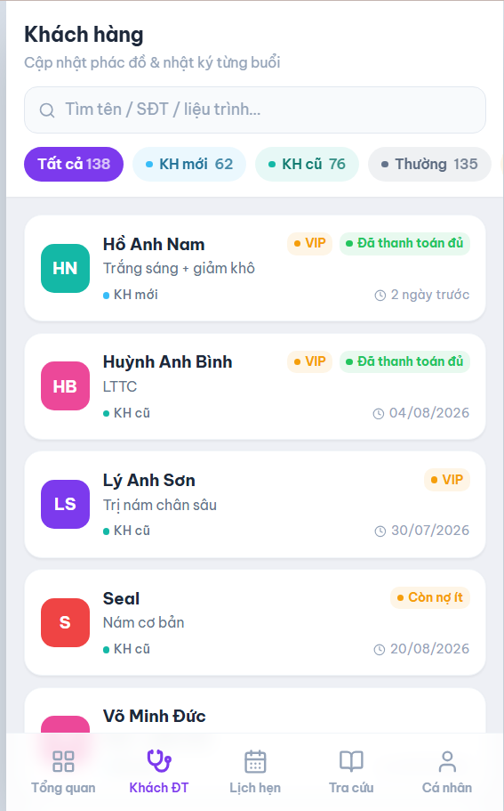

### C3. Chi tiết khách — Chốt gói

Khối **Chốt gói**: chọn **Đã chốt** (mở phác đồ + công nợ, đẩy hồ sơ sang CSKH) hoặc **Chưa chốt** (nhập lý do, trả hồ sơ về Telesale). Nếu khách đã có CSKH phụ trách thì hiển thị rõ.

<em>📸 Ảnh: Khối Chốt gói (Đã chốt / Chưa chốt)</em>

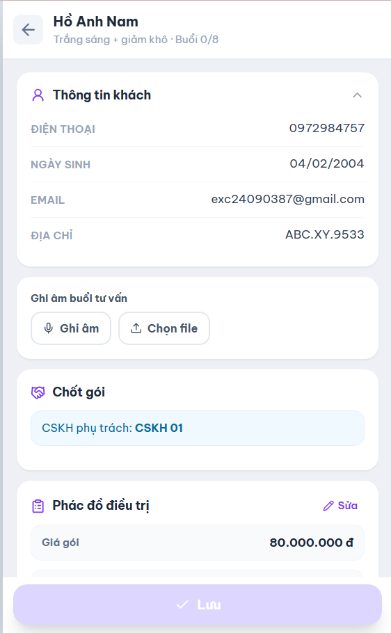

### C4. Phác đồ điều trị & công nợ

Nhập phác đồ theo **biểu mẫu có cấu trúc**: Tên liệu trình, Giá gói, **Tình trạng thanh toán** (Đã thanh toán đủ / Còn nợ — số còn nợ tự tính, có ngày hẹn trả tiếp), Bác sĩ, ĐTV, Mỹ phẩm, Tình trạng/mục tiêu, Note cho CSKH. Có chế độ **xem gọn** và nút **Sửa**.

<em>📸 Ảnh: Biểu mẫu phác đồ + tình trạng thanh toán</em>

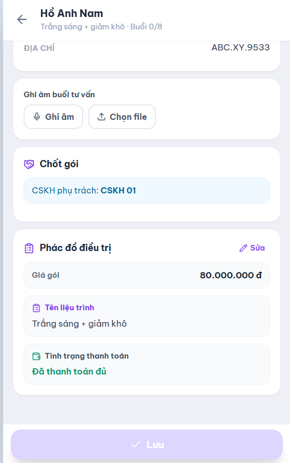

### C5. Ghi âm buổi tư vấn

Khối **Ghi âm buổi tư vấn**: **thu trực tiếp** từ micro hoặc **chọn file** ghi âm có sẵn; nghe lại và xoá được trước khi lưu.

<em>📸 Ảnh: Khối ghi âm buổi tư vấn</em>

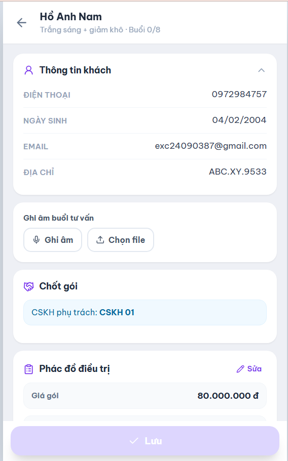

### C6. Lịch hẹn (theo giờ / theo phòng)

Xem lịch theo **dải ngày** (chọn nhanh hoặc chọn ngày bất kỳ), tìm theo tên/SĐT, lọc trạng thái (**Chờ / Đã xác nhận / Đang làm / Xong / Huỷ–vắng**). Hai chế độ xem: **Theo giờ** và **Theo phòng**; mỗi buổi hiện tài nguyên gán (ĐTV, phòng, bác sĩ, máy…).

<em>📸 Ảnh: Màn Lịch hẹn (chuyển đổi Theo giờ / Theo phòng)</em>

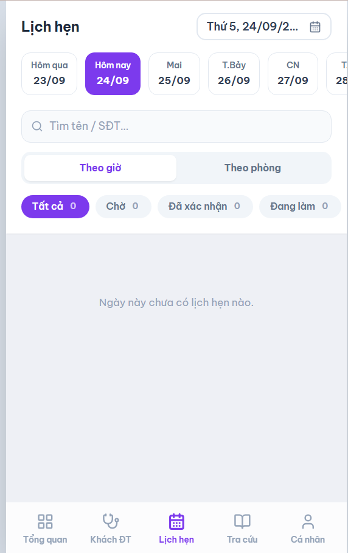

---

## D. Vai trò CSKH (Chăm sóc khách hàng)

Menu dưới: **Tổng quan · Việc hôm nay · Tra cứu · Cá nhân**.

### D1. Tổng quan CSKH

Lời chào + số **khách đang chờ đặt buổi** + chuông; **4 thẻ chỉ số**: Đang điều trị, Cần đặt buổi, Lịch hôm nay, Lịch tuần này. Danh sách **Khách đang điều trị** có **thanh tiến độ số buổi**, bấm để đặt buổi kế.

<em>📸 Ảnh: Tổng quan CSKH</em>

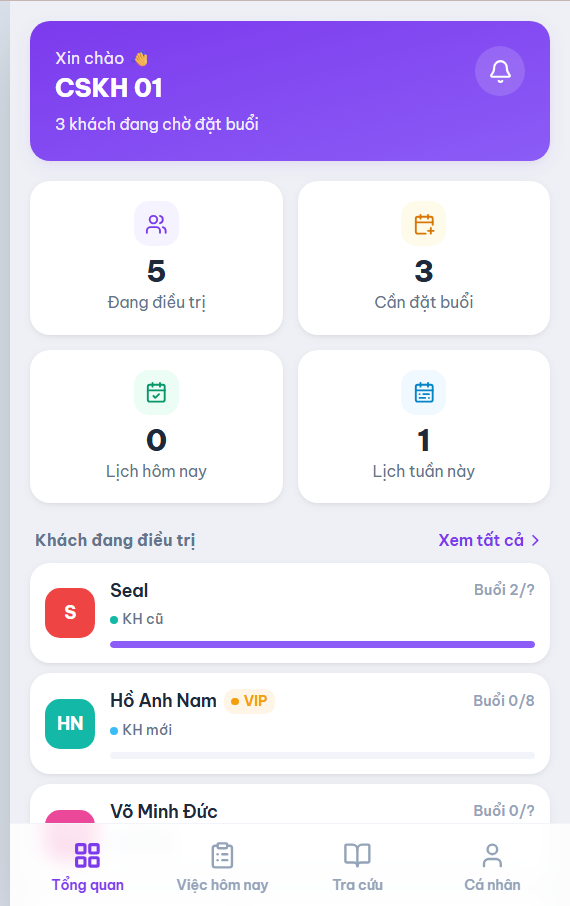

### D2. Việc hôm nay (xếp theo guồng chăm sóc)

Danh sách khách **xếp theo guồng chăm sóc, khách trễ nhịp lên trước**. Chip lọc theo **tình trạng chăm sóc** (Đang kết nối, Ít kết nối, Không kết nối, Bỏ liệu trình, Ngừng chăm, Kích ứng/Sự cố) và chip **"Đang trễ"**. Mỗi thẻ hiện giai đoạn chăm, nhịp chăm (Trễ N ngày / Tới hạn / Đã chăm hôm nay), hạng VIP và cảnh báo **sự cố** (viền đỏ).

<em>📸 Ảnh: Việc hôm nay + chip tình trạng chăm sóc</em>

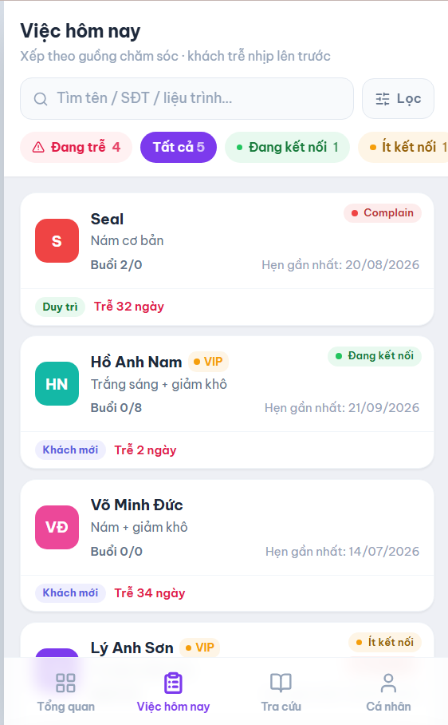

### D3. Bộ lọc nâng cao

Bottom-sheet **"Bộ lọc"**: lọc theo **Giai đoạn chăm sóc** và **Mức hài lòng** (Hài lòng / Chưa hài lòng / Complain), có nút Xoá lọc.

<em>📸 Ảnh: Bottom sheet Bộ lọc</em>

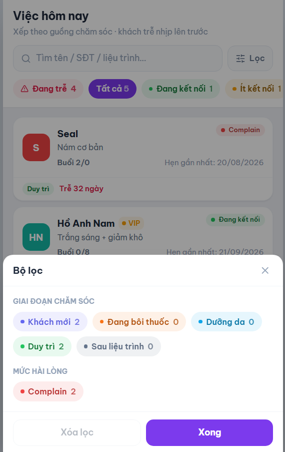

### D4. Chi tiết khách — Nhịp chăm & minh chứng

Tab **Tổng quan**: nút **"Tích đã nhắn/gọi"** để ghi nhận nhịp chăm hôm nay, kèm **ảnh minh chứng**; sửa **trạng thái chăm sóc / tình trạng da / mức hài lòng**; xem **hồ sơ khách**, **gói & công nợ** (chỉ đọc) và nghe lại **ghi âm tư vấn** của ĐTV.

<em>📸 Ảnh: Tab Tổng quan khách CSKH (nhịp chăm + minh chứng)</em>

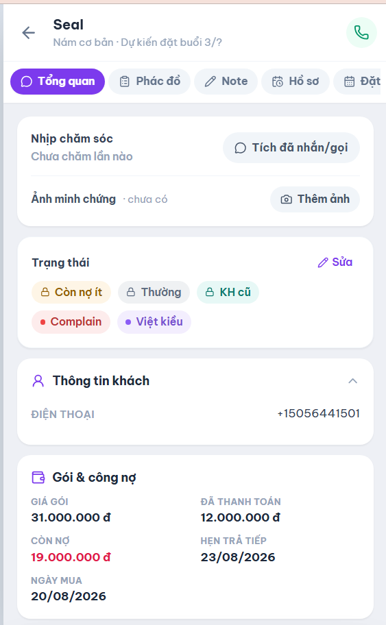

### D5. Phác đồ, Note & Hồ sơ điều trị

Tab **Phác đồ** (xem phác đồ ĐTV ghi), tab **Note khách** (ghi chú riêng của CSKH), tab **Hồ sơ** — nhật ký **từng buổi** gom theo bộ liệu trình: trạng thái, tình trạng da, ĐTV/bác sĩ, ảnh trước–sau, nút **Cập nhật buổi** / **Hoàn thành buổi**.

<em>📸 Ảnh: Tab Hồ sơ điều trị (nhật ký từng buổi)</em>

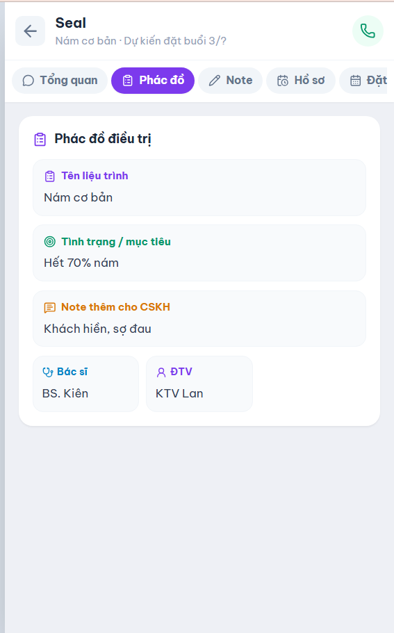

### D6. Đặt buổi tiếp theo

Tab **Đặt lịch**: chọn **ngày → chi nhánh → bác sĩ khám (không bắt buộc) → khung giờ** (theo chỗ trống thực tế), rồi **Đặt lịch buổi tiếp theo**.

<em>📸 Ảnh: Tab Đặt lịch buổi tiếp theo</em>

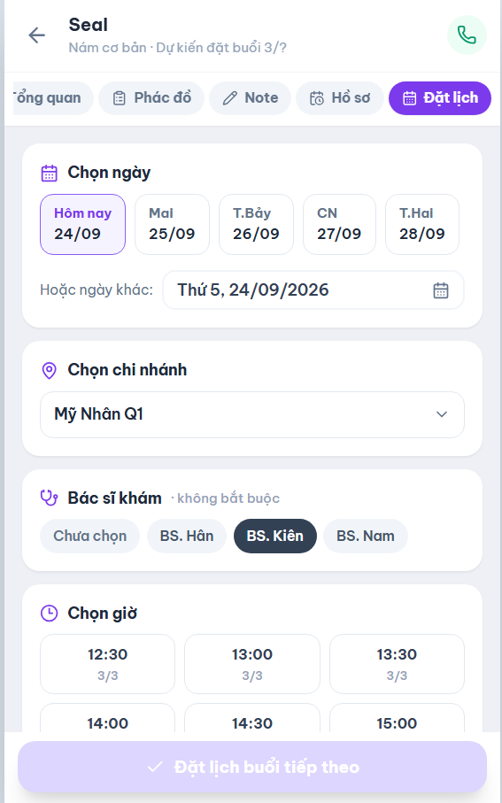

---

## E. Tính năng UI bên CEP web (liên quan app)

Đây là **các màn hình trên bản CEP web (desktop)** mà nhân viên/quản lý dùng, tương ứng với những gì app di động phục vụ. Mỗi mục ghi kèm **đường dẫn màn hình** để biết chỗ chụp ảnh. Điều hướng theo dạng `/{Controller}/{Action}`.

> ⚠️ Phần **ĐTV / phác đồ / chốt gói** chỉ có trên app di động — CEP web **không có** màn tương ứng, nên không đưa vào đây.

### Dùng chung

#### E1. Danh sách & hồ sơ khách hàng

Màn tìm kiếm khách với nhiều bộ lọc, banner **ngữ cảnh cuộc gọi đến** (SĐT/Facebook/email khách gọi vào) và lưới kết quả; mở thẻ khách để xem **hồ sơ động**, **ảnh khách** (gallery ảnh da từ phiếu), tạo nhanh khách bằng **OTP**. — `/Customer/Index`

<em>📸 Ảnh: Danh sách & thẻ hồ sơ khách trên CEP</em>

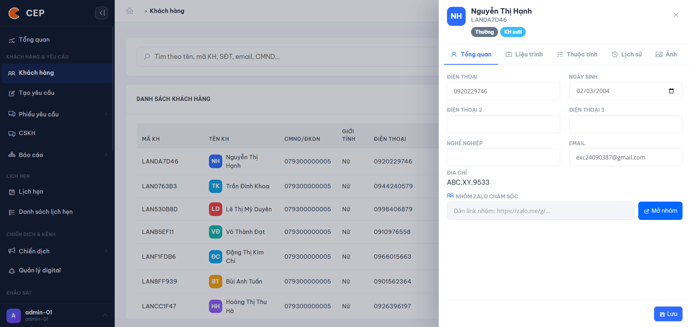

#### E2. Quản lý & tra cứu KB (cẩm nang)

Hai màn: **Quản lý thư viện** (tìm theo loại dịch vụ/trường động/ngày duyệt, cây thư mục, thêm/sửa/xoá/tải tài liệu) và **Tra cứu KB** (thẻ chủ đề phổ biến + ô tìm) — chính là nguồn cho màn Tra cứu trong app. — `/KnowledgeBase/Index`, `/Kb/Index`

<em>📸 Ảnh: Màn quản lý KB trên CEP</em>

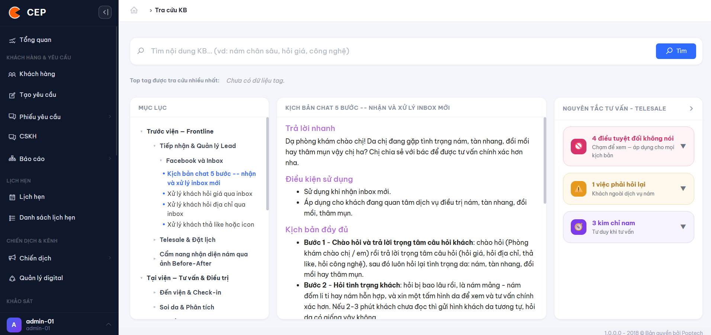

### Telesale

#### E3. Bàn làm việc telesale theo chiến dịch

Màn tổng quan của nhân viên gọi: **biểu đồ KPI** (đang theo, chưa gọi hôm nay, tới hạn theo quy tắc 15 ngày, gọi lại hôm nay), rồi vào **danh sách prospect** và **lịch hẹn** của chiến dịch. — `/AgentCampaign/Index`

<em>📸 Ảnh: Bàn làm việc telesale (KPI + prospect)</em>

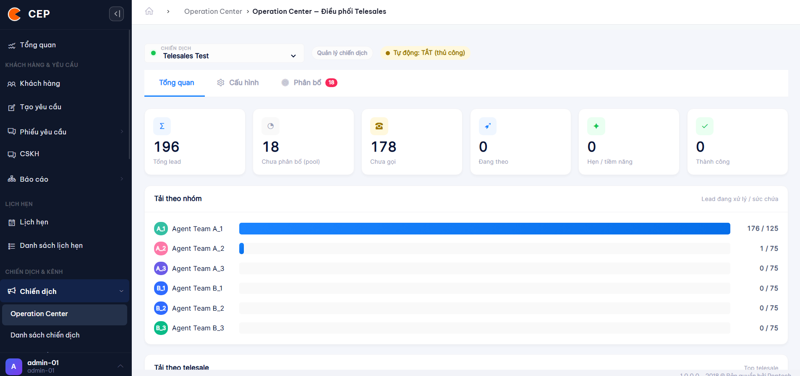

#### E4. Quản lý chiến dịch

Tạo/cấu hình chiến dịch theo loại (gọi / auto-dial / email / digital / khảo sát), thêm liên hệ, lên lịch, xem báo cáo cuộc gọi; và màn **cấu hình mã kết quả cuộc gọi** (tab "Mã kết quả" / "Bộ kết quả" / chiến lược gọi). — `/Campaign/Create`, `/CallResult/Index`

<em>📸 Ảnh: Cấu hình chiến dịch & mã kết quả cuộc gọi</em>

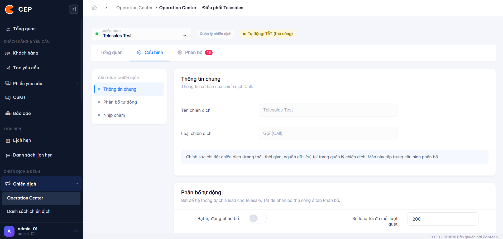

#### E5. Phân bổ lead cho nhân viên

Các màn quyết định **ai nhận lead**: cấu hình **phân bổ tự động** của chiến dịch, **định tuyến giao Task/Phiếu yêu cầu** theo loại dịch vụ / đơn vị nhận / người phụ trách, và **gán chiến dịch cho agent**. — `/CampaignAutoAssign/Config`, `/UserTaskAssignmentRouting/Index`, `/AgentCampaign/CampaignAssignTo`

<em>📸 Ảnh: Cấu hình phân bổ / định tuyến lead</em>

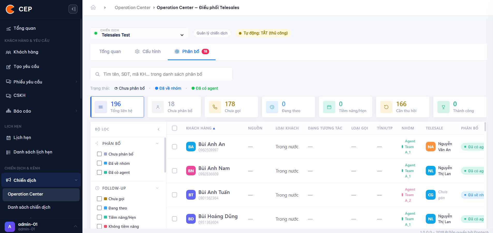

### Lịch hẹn (liên quan cả 3 vai trò)

#### E6. Bảng lịch hẹn trong ngày

Màn lễ tân/agent xem lịch trong ngày với **nhãn trạng thái** (chờ / đã xác nhận / đã đến / check-in / xong / huỷ / vắng / dời), bộ lọc **trễ hẹn**, tìm nhanh theo tên/mã; thao tác **check-in, khách vãng lai, xác nhận, huỷ, đánh dấu đã đến, hoàn thành**. — `/Calendar/Index`

<em>📸 Ảnh: Bảng lịch hẹn trong ngày</em>

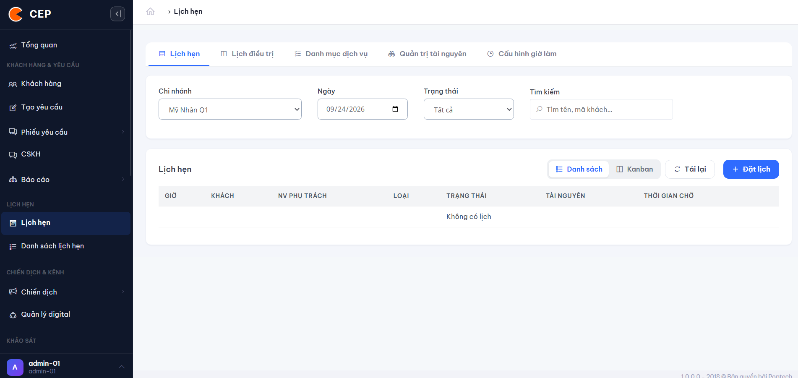

#### E7. Cấu hình lịch (địa điểm / tài nguyên / loại hẹn)

Admin quản lý **địa điểm & tài nguyên** (phòng, nhân sự, máy) và **loại hẹn** kèm khung giờ — nguồn để app hiện chi nhánh/khung giờ khi đặt lịch. — `/Calendar/Settings`, `/Calendar/ResourcesAdmin`, `/Calendar/AppointmentTypesAdmin`

<em>📸 Ảnh: Cấu hình địa điểm / tài nguyên / loại hẹn</em>

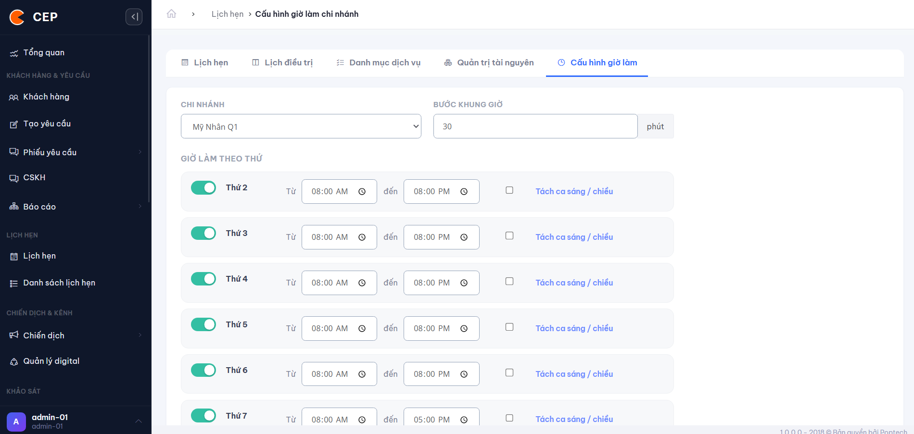

#### E8. Đặt / sửa / huỷ / trả / phân bổ lịch hẹn

Bộ form (modal) để **đặt, sửa, huỷ, trả, phân bổ** lịch hẹn cho đội/nhân viên field-sale và **ghi kết quả lịch hẹn**; kèm tab lịch sử & tracking của lịch hẹn. — `/Appointment/...`

<em>📸 Ảnh: Form đặt/xử lý lịch hẹn</em>

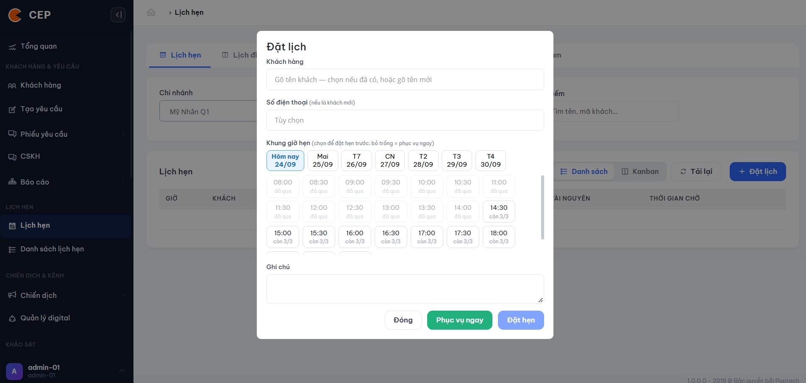

### CSKH (Chăm sóc khách hàng)

#### E9. Tổng quan CSKH

Dashboard quản lý CSKH: **thẻ KPI** và **thanh phân bố tình trạng chăm**; bấm thẻ để **xổ xuống danh sách** khách tương ứng. — `/CustomerCare/Dashboard`

<em>📸 Ảnh: Dashboard tổng quan CSKH</em>

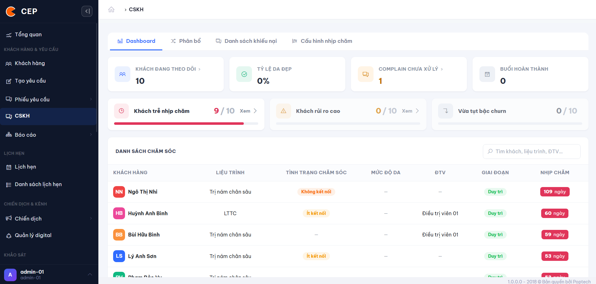

#### E10. Phân khách cho CSKH

Leader tick khách chưa có người chăm → thanh thao tác → chọn **chiến lược + CSKH + số lượng**, xem trước rồi xác nhận; kèm bật/cấu hình **tự động phân**. — `/CustomerCare/Assign`

<em>📸 Ảnh: Màn phân khách cho CSKH</em>

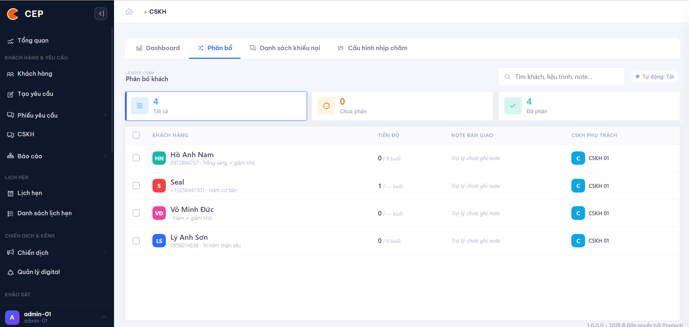

#### E11. Khiếu nại / phàn nàn

Danh sách khiếu nại có phân trang (mức độ cao/trung/thấp, trạng thái Mới → Chuyển xử lý → Đang xử lý → Đã giải quyết), lọc theo từ khoá/trạng thái và đổi trạng thái. — `/CustomerCare/Complaints`

<em>📸 Ảnh: Danh sách khiếu nại</em>

#### E12. Cấu hình nhịp chăm

Quản lý **các pha nhịp chăm** (thêm/sửa/xoá) — nền cho "guồng chăm sóc / nhịp chăm" hiển thị trong app; có thể cấu hình theo từng chiến dịch chăm. — `/CustomerCare/RhythmConfig`, `/CareCadence/ConfigSection`

<em>📸 Ảnh: Cấu hình nhịp chăm</em>

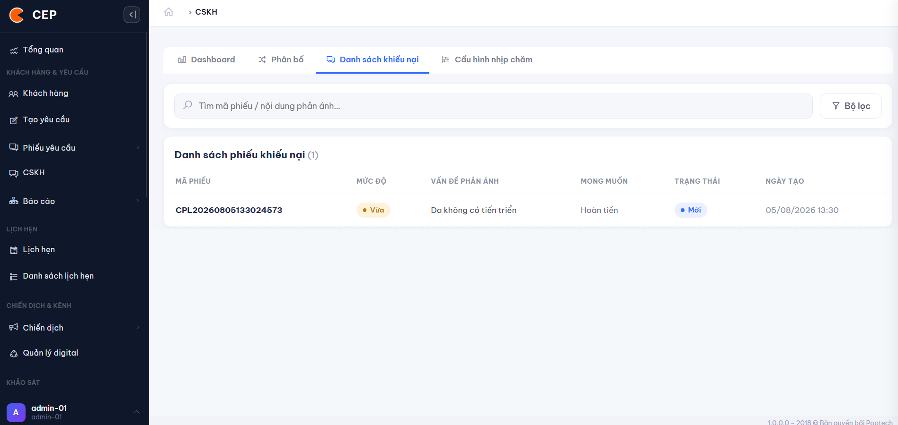

---

*Tài liệu mô tả tính năng để chụp ảnh minh hoạ. Ảnh đặt trong* `*docs/images/*` *theo đúng tên file tham chiếu ở mỗi mục.*
